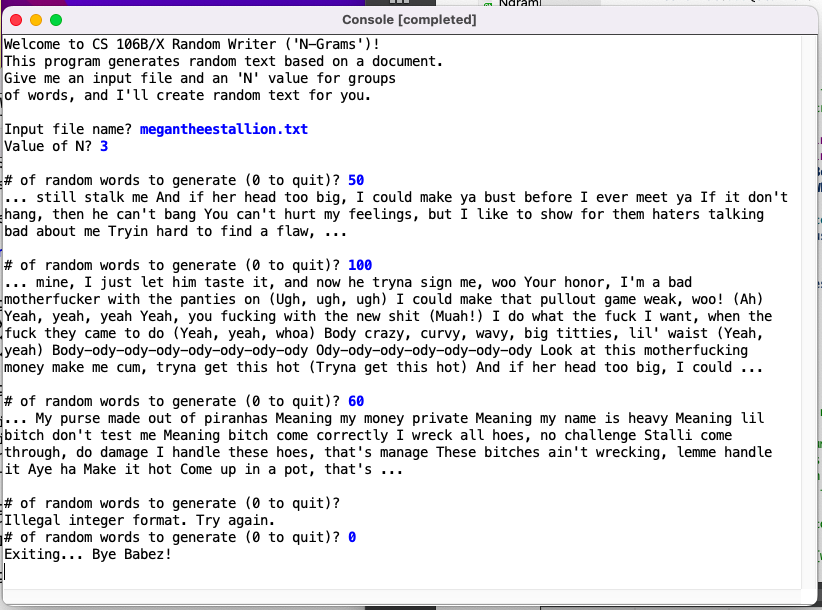
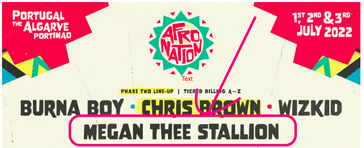

# Random Writer (Ngrams)

 Implementation of a random text writer using Ngrams

 This is Assignment #2b of CS106B Programming Abstractions module by Stanford University

 ## How the Random Writer Works

- The user is prompted to select the reference text
- This is used to build a N-grams maps with N being the number of consecutive words used as a string to look up the next word. See [Example 1](https://github.com/denwychan/ngrams#example-1---4-grams-ngram-map) for illustration
 - The user defines N for N-grams and the number of random text to generate

 

 The source code can be found in [src/ngrams.ccp](https://github.com/denwychan/ngrams/blob/main/src/ngrams.cpp) of this git repo

### Example 1 - 4-grams Ngram Map

` "Girls just want to have fundamental coding skills."`

    {{Girls, just, want, to} : {have},
    {just, want, to, have} : {fundamental},
    {want, to, fundamental} : {coding},
    ...}

 ## The 'Infinite Monkey Theorem'

 The 'Infinite Monkey Theorem' states that an infinite number of monkeys typing random keys forever would eventually produce the works of William Shakespeare

 Selecting totally random workds would likely produce gibberish, however, when chain of N words (or N-grams) are considered together *and* the probability of choosing each is weighted on how frequently it appears in Shakespeare's work, the results could 'sound like' Shakespeare's works

Text randomly generated in this way is also known as a Markov chain

## Rap like Megan Thee Stallion using N-grams

The author of this Random Writer (Ngrams) implementation is very fond of the Pink Rap genre, and particularly admires artist Megan Thee Stallion after seeing her in Afronation 2022.

The following excerpt has been generated using the Random Writer as an homage to Megan:

`... down on him 'fore I have a [censored] running me Talk yo' 💩, bite your lip Ask for a car while you ride that 🍆  (while you ride that 🍆 ) You ain't never gotta 🍆  him for a thing He already made his mind up 'fore he came Now get your boots and your coat for this wet ass 🐱 Now make it rain if you wanna see some wet ass 🐱 Look, I need a hard hitter, I need a deep stroke I need a Henny drink, I need a weed smoker Not a garden snake, I need a ...`

